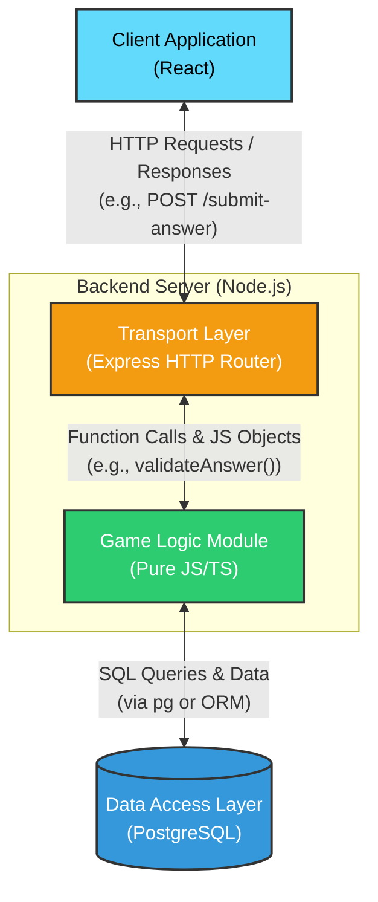
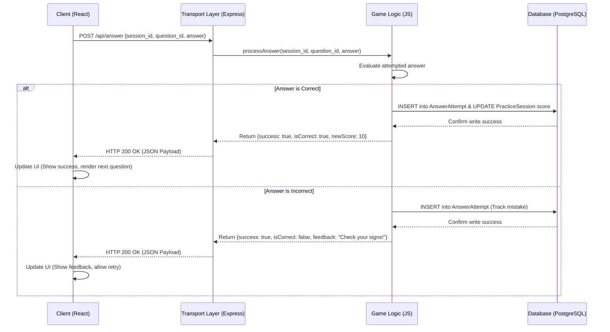
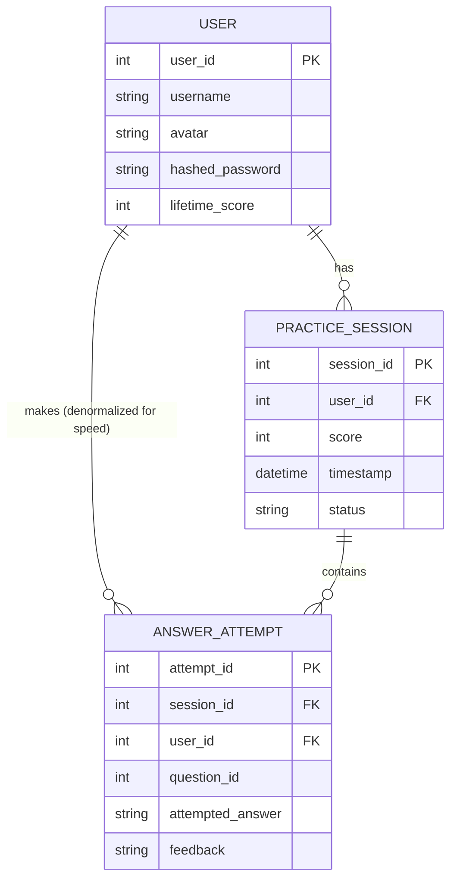

# Project description:

High-school level math education game for students. For the basic version of our app, we just have single-player practice sessions, while for the future, we look to host real-time multiplayer matches. There will also be a hidden storyline feature for dedicated players.

## Possible Frameworks to use:
- Client: React
- Server: Node.js and Express
- Database: PostgreSQL （Relational DBMS makes tracking friend relationships easier.)

---
## Basic components: Signup and login, Main page, Practice page. 
- Practice page presents the user with one question at a time, five or so questions total per session. Once the player types their answer into the field and submits, they get feedback and the chance to move on to the next question. 
- The main page displays their progress and their friends' progress.

## Design Points:
- Before we start coding, agree on the exact properties of the JSON objects.
	- HTTP payloads: #TODO:
        - AccountSignUp
        - AccountLogin
        - MathQuestion
        - MathResponse
        - MathFeedback
	- Database entities: 
		- User (core identity data: ID, username, hashed password and lifetime score), 
		- Friendship (user_id_1, user_id_2, status: pending or accepted)
		- PracticeSession (user_id, session_id, score, timestamp, status: active or done)
		- AnswerAttempt (user_id, session_id, question_id, attemptedAnswer, feedback)
		- [Later] StoryProgress (user_id, unlocked_chapter, ...)
We should agree on these in order to avoid costly changes down the road.

- Decoupled design inside the server: Game Logic and Transport Layer should be separate. Game logic are pure JS functions and includes things like `validateAnswer()`, `calculateScore()` and `retrieveNextQuestion()`. Transport Layer involves an object that receives HTTP requests, passes them to the Game Logic and sends HTTP responses back. The Transport Layer for Phase 1 will simply be done in Express, but from Phase 2 onwards, we will also need a WebSocket Transport Layer to keep open a two-way connection for real-time PvP matches.

- How should React remember things across different pages? Eg. User information from the login page to the main page to the practice page. We can use the React Context API.

## Accompanying UML Diagrams:
- Decoupled Server Structure:

- Answering a question:

- ERD for Database Entities

---
## App Architecture:
- Client: Handles the user interface, renders the math questions, captures input, and displays the progress dashboard. It should NEVER hold the answers to the questions; it should only send the user's input to the server.
- Server: It acts as the source of truth, handling user authentication, verifying submitted answers, calculating progress and manages friend connections.
- Database: To track account logins across devices, identifying friends, tracking player milestones and elo rankings for matchmaking.

## Three layers of testing:
- Unit Testing (Jest or Vitest): Test backend functions in isolation, eg. verifying that 1/2, 0.5, and 2/4 are all valid answers to a question.
- Component Testing (React Testing Library): Frontend testing. Eg. when the "Submit" button is clicked, the loading spinner appears, and the feedback message renders correctly based on the server's response.
- End-to-End Testing (Cypress or Playwright): Automated simulation of a user. Programmatically open a browser, log in, add a friend, complete a 5-question practice session, and verify that the progress bar updated on the main page.

---

## End-to-end testing ideas:
- Client: React app on a local development server (at http://localhost:5173).
- Server: Express app runs via Node.js in terminal (at http://localhost:5000).
- Database: PostgreSQL runs securely in the background (on port 5432).

